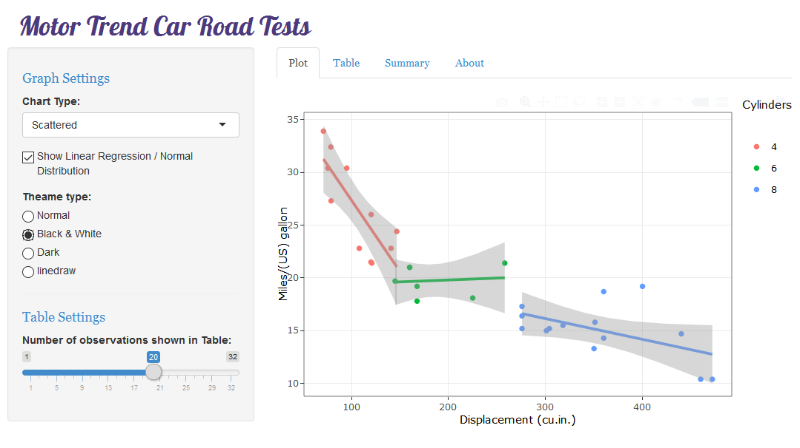

# Developing Data Products Assignment
Jayant Dhawale  
October 7, 2017  

## Project Assignment

Create Shiny Application

- Write a shiny application with associated supporting documentation. The documentation should be thought of as - - - - whatever a user will need to get started using your application.
- Deploy the application on Rstudio's shiny server
- Share the application link by pasting it into the provided text box
- Share your server.R and ui.R code on github

The application must include the following:

- Some form of input 
- Some operation on the ui input in sever.R
- Some reactive output displayed as a result of server calculations
- You must also include enough documentation so that a novice user could use your application.
- The documentation should be at the Shiny website itself. Do not post to an external link.

## The Shiny App

## Help on Shiny App

This app help to provide quick Exploratory Data Analysis on mtcars dataset.
The App divided in two section, control panel at left and display panel on righthand side.

-  <b> Control Panel </b>  
      In this panel you can control how your app behave with different display panels.
      It allows users to control Graph settings and table setting.
      use chart type to control different chart display , the checkbox below allow the display of linear regression line or normal distribution line on scattered or hectograph chart.
      Theme type radio button allow controlling the look and feel of graphs.
      The slider in table setting allow user to control number of rows in table diplay

      
-  <b> Display Panel </b>  
     This panel can help to control display of different views.
     you can use the top tabs to change the different views, by default plot is shown.
     * Plot tab : It shows the respective chart as selected in chart type.
     * Table tab : It shows the mtcars table content, the number of rows can be controlled using settings.
     * Summary: It shows the summary for mtcars table.
     * About: Details about app.

## About App

The source code for app can be found at below github url:
[https://github.com/JDACN/DDP](https://github.com/JDACN/DDP)
